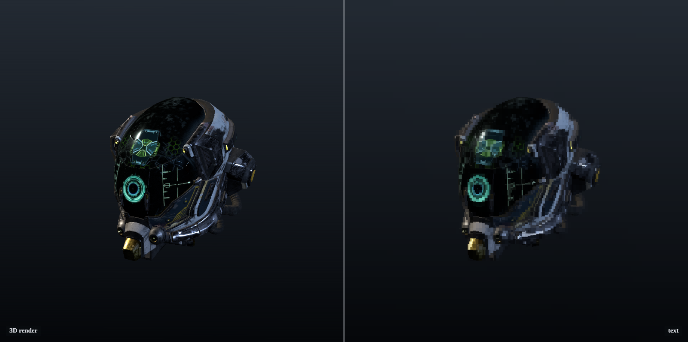
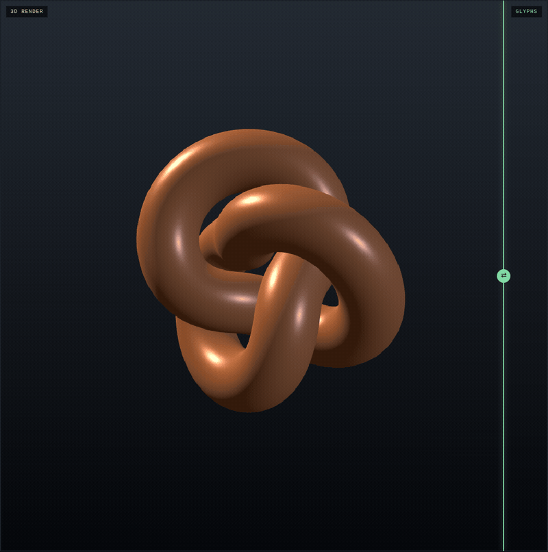
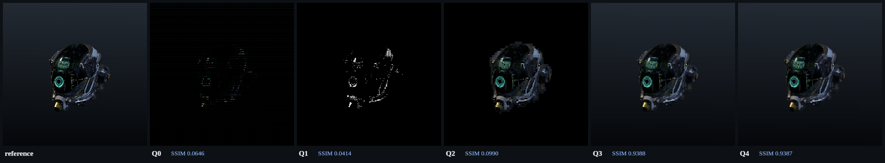
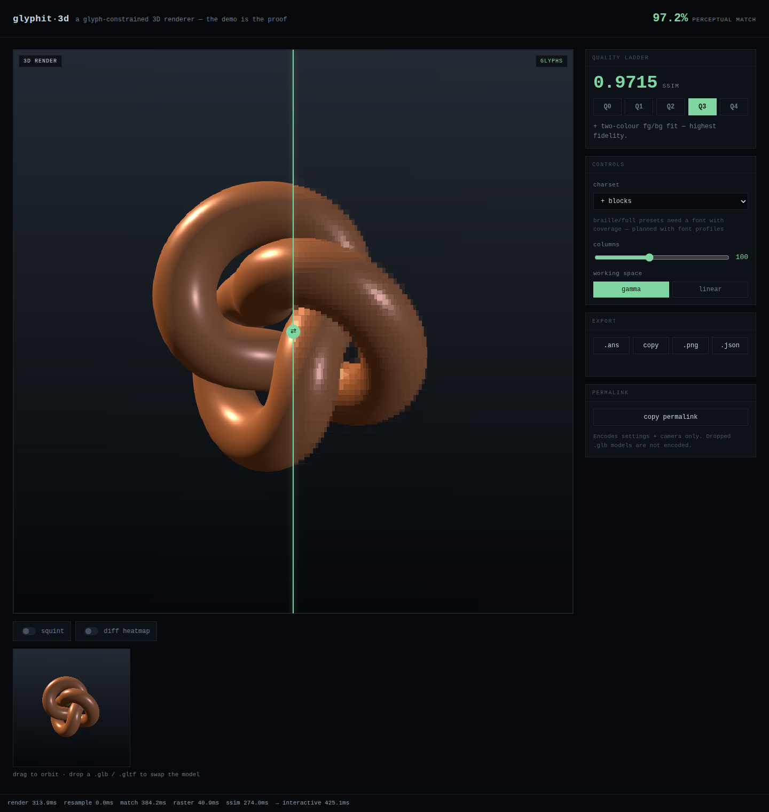

# Glyphit3D

> Chafa's symbol mode, but driven by real 3D G-buffers instead of a flat image,
> using a continuous grayscale font-profiled glyph atlas with true
> alpha-composite two-color least squares — made temporally stable and
> GPU-real-time.

That sentence is the **thesis**. What actually ships today is the first two
clauses, on CPU: a 3D G-buffer bake pipeline and a continuous-coverage two-color
matcher that already edges [chafa](https://hpjansson.org/chafa/) on the shared
benchmark. Temporal stability is on the roadmap; the **WebGPU Q3 matcher** now ships —
but the full GPU raster remains a follow-up, so the interactive loop is not yet
GPU-real-time end to end. See [Status](#status).





*Drag the divider in the [web demo](#web-demo): the left half is a normal 3D
render, and **the right half is text** — one glyph plus two colors per terminal
cell.*

## Why this is different

- **It matches a 3D G-buffer, not a flat image.** Every other terminal-image
  converter (chafa, notcurses, timg, catimg) starts from a finished 2D picture.
  Glyphit3D renders the model to separate depth / normal / object-id / albedo
  buffers first, and those buffers feed glyph selection — so the engine can tell
  a silhouette edge from a texture edge. In the prior art we surveyed
  (see [DESIGN.md §1](DESIGN.md)) this is the least-precedented part.
- **Per-cell glyph + two-color matching is not new, and we don't claim it.**
  "One glyph plus two colors per cell, chosen to minimize color error" is
  40-year-old prior art — PETSCII / teletext converters and chafa's symbol mode
  all do it. We extend it; we did not invent it.
- **What we extend is the coverage model.** chafa matches an 8×8 **1-bit** glyph
  bitmap and colors each cell from mask-group means. Glyphit3D builds a
  **continuous** (anti-aliased) font-profiled coverage atlas and solves a
  closed-form **alpha-composite two-color least-squares** fit per cell —
  *continuous-coverage least squares vs chafa's 1-bit-coverage mean*. That is the
  measurable margin, and the benchmark below is where we test it.

## Benchmarks

The hard gate (DESIGN §10): does our matcher beat chafa 1.18.2 at the **same
task** — truecolor character-cell art in one monospace font — when **both**
outputs are re-rasterized through the **same** DejaVu Sans Mono atlas and scored
by grayscale SSIM against the same reference? Both engines are handed the
identical glyph repertoire and the identical grid-footprint reference, so each
optimizes the exact pixels it is graded on.

| image | ours (Q3) | chafa (best) |
|---|---|---|
| sphere | **0.9834** | 0.9832 |
| torus | **0.9824** | 0.9821 |
| spheres | **0.9846** | 0.9783 |
| DamagedHelmet | **0.8677** | 0.8603 |
| FlightHelmet | **0.9718** | 0.9697 |
| BoomBox | **0.9301** | 0.9251 |
| **mean** | **0.9533** | **0.9498** |

**Honest scope.** This validates only the **2D continuous-coverage least-squares
margin** — both engines are re-rasterized through the same font, and it says
nothing yet about the 3D pipeline. At production defaults ours wins all six images
and the mean by **+0.0035**, and the margin is *larger* on textured, edge-dense
content (DamagedHelmet +0.0074) — exactly where continuous coverage should help.
Full protocol, symbol-mapping fairness decisions, and the masked-SSIM localization
are in [bench/README.md](bench/README.md).

**Synthesized families (M3).** Adding the exact-region block/braille families
(`--families`) widens the honest, strictly-fair margin — atlas + braille granted to
**both** engines — to **+0.0034**.[^fam] The gain is the region solver, not the
repertoire: chafa declines the braille it is handed.

[^fam]: A full-capability run reports **+0.0058**, but that credits ours for the
    U+1FB00 sextant range chafa 1.18.2 emits zero glyphs from; the strictly-fair
    +0.0034 is the number we stand behind. Full record in
    [docs/M3-RESULTS.md](docs/M3-RESULTS.md).

Reproduce (no flags = production defaults):

```bash
npx tsx bench/chafa-gate.ts --images sphere,torus,spheres,DamagedHelmet,FlightHelmet,BoomBox
```

**We also publish our null results.** M1 tested whether a 3D *selection prior*
(shading-split, object-id anti-bleed) could raise per-cell reconstruction SSIM in
unconstrained truecolor. It provably cannot — the exhaustive two-color fit is
already the per-cell optimum, so any selection prior can only tie or hurt. The
mechanism works exactly as specified and the metric is sound; the result is still
null, and it is documented in full in
[docs/M1-RESULTS.md](docs/M1-RESULTS.md) rather than hidden.

## The quality ladder

Each rung adds one capability. The demo *is* the ablation study — click a rung
and the live SSIM updates.



| rung | what it adds | intended use |
|---|---|---|
| Q0 | fixed brightness ramp (baseline strawman) | demo comparison only — not exposed on the CLI |
| Q1 | glyph shape matching, monochrome | classic ASCII aesthetic |
| Q2 | + foreground color fit (background fixed) | TUI-insertion default |
| Q3 | + foreground/background two-color fit | highest fidelity (CLI default) |
| Q4 | + edge / multi-scale loss | contour preservation |
| Q5 | + 3D-aware priors: synthesized family selection (shipped); silhouette/contour priors (published null) | family solver shipped (M3) |

The near-zero SSIM at Q0–Q2 is real, not a bug: those rungs paint on a fixed
(black) background, so against a scene that has a gradient background their score
collapses. The two-color fit at **Q3** is what recovers the background and jumps
fidelity to 0.94 — the same continuous-coverage margin the benchmark measures,
shown visually.

## Quickstart

Node 24+ (ESM). DejaVu Sans Mono is expected at
`/usr/share/fonts/truetype/dejavu/DejaVuSansMono.ttf` (Debian/Ubuntu:
`fonts-dejavu-core`); pass a different TTF with `--font`.

```bash
git clone https://github.com/Dev-Jahn/glyphit3d.git
cd glyphit3d
npm install
```

### CLI: bake a 3D model to glyphs

Fetch the fixed Khronos model zoo, then bake one model straight to a PNG. The
`bake` command renders the model to G-buffers (three.js, headless) and matches
them to the glyph atlas:

```bash
npx tsx scripts/fetch-zoo.ts    # → bench/zoo/ (gitignored)
npx tsx src/cli.ts bake bench/zoo/DamagedHelmet/DamagedHelmet.gltf \
  --cols 120 --quality 3 --png helmet.png --stats
```

`--stats` prints the grid, glyph count, SSIM, and match time; drop `--png` to
stream truecolor ANSI to your terminal instead (`| less -R`). You can also point
`bake` at a pre-baked AOV directory to skip the render.

### Web demo

```bash
npm run dev     # vite dev server; open the printed http://localhost:5173/
```

Drag any `.glb` / `.gltf` onto the page to swap the model, drag on the canvas to
orbit, then drag the divider to un-blur the glyph side. The quality ladder,
charset/column controls, diff heatmap, "squint" toggle, and ANSI/PNG/JSON export
are all live.



## Status

Roadmap milestones (full plan in [DESIGN.md §12](DESIGN.md)):

- **M0 — shipped.** Image→glyph optimizer core (closed-form two-color fit,
  contrast gate, ANSI/HTML/PNG export). Passes the chafa hard gate above.
- **M1 — shipped.** 3D static bake: three.js G-buffer AOV pipeline + the first
  3D-native ablation. Produced a documented truecolor selection-prior null
  (above).
- **M2 — shipped.** Interactive web demo — un-blur scrubber, quality ladder with
  live SSIM, permalink, PNG export. The matcher runs on the CPU in a Web Worker.
  Playwright E2E: 8/8.
- **M3 — shipped.** Gate redesign (τ 2e-5) + synthesized ideal-mask families
  (quadrant/sextant/braille, exact region solver) lift the chafa gate to a
  strictly-fair **+0.0034** and win all six images; the silhouette/orientation and
  contour-DP cross-cell priors were measured and **published as a null** (edgeSSIM
  1/6, 0/6) — DESIGN §4.3 retracted. See [docs/M3-RESULTS.md](docs/M3-RESULTS.md).
- **WebGPU Q3 matcher — shipped (2026-07).** The CPU matcher was parallelized across a
  worker pool, then a **WebGPU compute matcher** landed for the Q3 default web path:
  **byte-exact parity with the CPU closed-form** (glyph 100%, ΔSSIM 0 across the
  parity harness), GPU compute ~1.25ms vs ~118ms pool. The WebGL2 render and the
  WebGPU match both run on the GPU on a secure context; browsers without WebGPU use
  the CPU pool. See [docs/WEBGPU-MATCHER-SPEC.md](docs/WEBGPU-MATCHER-SPEC.md).

Unit tests: `npx vitest run` (126 passing). E2E: `npm run e2e` (9/9).

The founding design document is [DESIGN.md](DESIGN.md) — including the honest
prior-art table and the forbidden-claims list that constrains all copy here.
The profile payload written by `web/src/profile.ts` is a byte-level external
contract for third-party font-profile generators — see
[docs/PROFILE-PAYLOAD-CONTRACT.md](docs/PROFILE-PAYLOAD-CONTRACT.md).
설계 문서는 한국어로 작성되어 있습니다 (the design doc is written in Korean).

## License

[MIT](LICENSE) © 2026 Jahn (Dev-Jahn).
