<!-- GENERATED by jahns-workflow (jw_roadmap.py) — DO NOT EDIT.
     Source of truth: tasks.yaml. Regenerated automatically on tasks.yaml edits. -->
# Roadmap — glyphit3d

**Progress:** 29/42 done · 0 active · 0 blocked · generated 2026-07-10 12:26 UTC @ `f8d033d`

```mermaid
flowchart TD
    subgraph backlog["(no milestone)"]
        chore_adopt_jahns_workflow["<b>chore/adopt-jahns-workflow</b><br/>jahns-workflow 하네스 도입<br/>(SSOT/tasks/packet 리뷰)"]
        docs_metric_redesign["<b>docs/metric-redesign</b><br/>재구성 지표 재설계: SSIM 포화 → 셀<br/>스케일 고주파 AC 구조 지표 + 물체 마스크<br/>+ 분포(하위 percentile) 보고,<br/>SSIM은 가드레일로 강등"]
        feat_ascii_identity_selection["<b>feat/ascii-identity-selection</b><br/>구조 인지 문자 선택: 균일/밝은 영역엔 면적<br/>큰 문자, 미묘한 gradient엔 조절된 작은<br/>문자"]
        feat_contrast_floor_fill["<b>feat/contrast-floor-fill</b><br/>어두운 영역 검은 구멍 잔여분: fitted-<br/>path invisibility(검정 위 dim<br/>fg) 대비 하한 제약"]
        feat_shape_color_coupling["<b>feat/shape-color-coupling</b><br/>형태-색상 coupling: 셀 사각영역 전체<br/>광량/조도 반영해 문자색 명도·채도 조절"]
        decision_public_repo_toggle["<b>decision/public-repo-toggle</b><br/>private→public 전환 여부 (전환 시<br/>Pages 웹 데모 자동 배포)"]
        perf_webgpu_matcher["<b>perf/webgpu-matcher</b><br/>WebGPU WGSL matcher (근본 성능<br/>개선)"]
        feat_palette_constrained_color["<b>feat/palette-constrained-color</b><br/>palette-256/theme16 제약 색<br/>모드 (디더 배리어·M1 prior 활동 공간)"]
        feat_temporal_animation["<b>feat/temporal-animation</b><br/>temporal/애니메이션: motion-<br/>vector hysteresis, delta<br/>frames"]
        chore_e2e_gpu_rendering["<b>chore/e2e-gpu-rendering</b><br/>e2e/verify Chromium을<br/>SwiftShader에서 --use-<br/>angle=vulkan으로 전환 (실 GPU<br/>렌더, 실사용자 환경 대변)"]
        perf_gpu_rasterizer["<b>perf/gpu-rasterizer</b><br/>GPU 경로의 메인스레드 CPU<br/>래스터(~96ms)를 GPU로 — WebGPU<br/>매처 후 남은 인터랙티브 병목"]
        fix_rematch_single_flight["<b>fix/rematch-single-flight</b><br/>rematch(): 단일<br/>비행(seq/generation) 가드로 최신<br/>run만<br/>grid/raster/SSIM/perf를<br/>commit — 느린 이전 run이<br/>화면·export(json/ans/png)를<br/>덮어쓰지 못하게. controls/ladder의<br/>bare rematch()도 동일 큐를 타야 함"]
        fix_gpu_matcher_p_guard["<b>fix/gpu-matcher-p-guard</b><br/>GpuMatcher:<br/>ensureCellBuffers 캐시 키에 P<br/>포함(numCells만 아님)하고<br/>P&gt;256 거부/상한(WGSL sT<br/>array&lt;f32,768&gt;=3·256<br/>고정으로 첫 run부터 OOB); same-<br/>numCells/different-P 회귀<br/>테스트 추가"]
        decision_profile_stats_objective_contract["<b>decision/profile-stats-objective-contract</b><br/>프로파일 scalar stats(sumA/sum<br/>AA/gradAA/ink) objective<br/>계약 확정: hash 대상<br/>truth(Contract B, hash 범위<br/>확대)인가 coverage에서 decode-<br/>time 재계산(Contract A,<br/>DESIGN §5.4/§5.2)인가 — 현재 B<br/>데이터모델+A hash 범위 혼종이 무결성 공백"]
        docs_wgsl_mirror_kahan_comment["<b>docs/wgsl-mirror-kahan-comment</b><br/>wgsl-mirror.ts stale Kahan<br/>주석 정정: 커널은 8-way-blocked<br/>raw cross 후<br/>saTc=saT−Sa1·mean<br/>(matcher-wgsl.ts 헤더와 동일<br/>표현으로); 수치 무영향 doc drift"]
        fix_e2e_liveness_frame_budget["<b>fix/e2e-liveness-frame-budget</b><br/>e2e check-7 정정: GPU 경로<br/>raster는 메인스레드 동기(~96ms,<br/>주석의 off-thread는 오기),<br/>vacuous한 maxGap&lt;dur를 실제<br/>프레임예산 임계(longtask/maxGap&l<br/>t;~50ms)로 교체"]
        docs_gpu_realtime_wording["<b>docs/gpu-realtime-wording</b><br/>README 헤드라인 'GPU-real-<br/>time' 문구 축소(O3): 'WebGPU<br/>Q3 matcher shipped; full<br/>GPU raster/temporal<br/>coherence remain follow-<br/>ups' — 메인스레드 raster ~96ms<br/>잔존 반영"]
        chore_parity_adversarial_fixtures["<b>chore/parity-adversarial-fixtures</b><br/>parity harness 적대적 fixture<br/>보강(O1): synthetic high-<br/>DC/low-AC 셀, gateTau 경계,<br/>exact/near-tie lower-gi 보존<br/>property, P/G sweep —<br/>'byte-exact'를 유한 14-config<br/>sweep 너머로 확장"]
        fix_profile_hash_canonical["<b>fix/profile-hash-canonical</b><br/>profileHash를 canonical<br/>payload 전체로 확장(Contract B,<br/>ADR-0001): verifyProfileHa<br/>sh+exporter가 coverage뿐 아니라<br/>스칼라(sumA/sumAA/gradAA/ink)<br/>+폰트/셀 메타까지 해싱; 스칼라 변조 거부<br/>테스트 추가; decodeProfile은 저장<br/>스칼라 신뢰 유지"]
        chore_compose_hero_canvas_types["<b>chore/compose-hero-canvas-types</b><br/>기존 tsc 실패:<br/>scripts/compose-hero.ts가<br/>@napi-rs/canvas SvgCanvas<br/>vs Canvas 타입 불일치(37:3<br/>TS2741, 61:17 TS2345) — 이번<br/>라운드 무관, 릴리스 스크립트, HEAD부터<br/>존재"]
        chore_braille_charset_noop["<b>chore/braille-charset-noop</b><br/>braille 문자셋이 blocks와 byte-<br/>identical 출력(동일 hash) —<br/>DejaVuSansMono에 braille<br/>glyph 부재로 필터링돼 UI의 braille<br/>선택이 사실상 no-op; 기존 동작, 폰트<br/>종속"]
        fix_rematch_single_flight_gpu_race["<b>fix/rematch-single-flight-gpu-race</b><br/>모든 rematch(control/ladder/<br/>orbit)를 단일 큐로 직렬화 — 공유<br/>GpuMatcher staging buffer의<br/>host map-state 경합<br/>차단(F1R-1). seq 가드는 stale<br/>commit만 막고 동시 gpu.match()<br/>재진입은 못 막아 최신 run wrong-<br/>frame/noisy CPU fallback<br/>발생"]
        fix_gpu_matcher_cstat_host_realloc["<b>fix/gpu-matcher-cstat-host-realloc</b><br/>gpu-matcher: cstatHost를 자체<br/>numCells*16 조건으로 재할당(현재 ta<br/>rgetHost.length==numCells*<br/>3*P 단일 조건에 편승, F2R-1) —<br/>numCells*P 동률·numCells 증가<br/>시 cstatHost stale→tail셀<br/>stats 0→P≤256라 fallback 없이<br/>silent 오출력. 충돌쌍 host-<br/>scratch 단위테스트 추가"]
        docs_profile_payload_external_contract["<b>docs/profile-payload-external-contract</b><br/>OQ2: F3 Contract B<br/>canonical payload는 외부<br/>profile generator에 강한 계약 —<br/>브라우저 'TTF로 프로파일 생성' 도구 착수<br/>시 buildCanonicalPayload를<br/>공유 lib로 노출하거나 독립 구현은<br/>profile version bump 강제"]
        fix_rematch_promise_completion["<b>fix/rematch-promise-completion</b><br/>__app.rematch() promise가<br/>coalesce되면 실제 작업 완료 전에<br/>resolve — 공개 Playwright/UI<br/>surface의 완료 의미 변경(wave1 리뷰<br/>minor)"]
        fix_torn_runparams_snapshot["<b>fix/torn-runparams-snapshot</b><br/>torn runParams snapshot:<br/>ensureAtlas await 후 params<br/>재읽기로 old-charset atlas +<br/>new params가 한 commit에 페어링될<br/>수 있음(선재 결함, wave1 리뷰 발견)"]
        fix_contrast_floor_linear_space["<b>fix/contrast-floor-linear-space</b><br/>contrastFloor: fit-space<br/>floor가 linear mode raster-<br/>space 가시성과 미페어링 +<br/>#space=linear에서 demo<br/>floor=0.06 유지(wave1 리뷰<br/>minor)"]
        docs_contrast_floor_design_amendment["<b>docs/contrast-floor-design-amendment</b><br/>DESIGN §3.4 개정:<br/>contrastFloor를<br/>collapseThreshold 옆 새 opt-<br/>in 미학 knob으로 정식 등재(boost-<br/>or-demote 의미론, 재구성 비용<br/>−0.0054 실측 포함)"]
        fix_palette_q0_guard["<b>fix/palette-q0-guard</b><br/>--quality 0 + --palette<br/>조합이 palette를 조용히<br/>무시(rampGrid 경로 guard 우회) —<br/>명시적 거부/경고로(wave1 리뷰 minor)"]
        chore_vitest_worktree_exclude["<b>chore/vitest-worktree-exclude</b><br/>vitest가 .claude/worktrees<br/>하위 중첩 repo 사본까지 수집(기본<br/>include가 root-anchored<br/>exclude 우회) —<br/>**/.claude/** exclude 추가"]
        perf_wgsl_resident_prep["<b>perf/wgsl-resident-prep</b><br/>raster spec §4.4에서 의도적 연기된<br/>full-GPU-residency<br/>prep(WGSL 상주) — 현재는 worker<br/>prep+writeBuffer; 남은 main-<br/>thread 잔여 ~12ms를 더 줄일 때만"]
        fix_p256_q3_fallback_double_render["<b>fix/p256-q3-fallback-double-render</b><br/>P&gt;256 Q3 fallback이<br/>rematch마다 render+worker-<br/>prep+re-render 이중 비용(늦은<br/>assert; prepQ3가 imgData를<br/>detach해 catch에서 재렌더) — 조기<br/>capability check로(chainA<br/>리뷰 minor)"]
        perf_prep_buffer_pool["<b>perf/prep-buffer-pool</b><br/>prepQ3가 요청마다 12MB work<br/>이미지(비인터랙티브시 +12MB lin) 신규<br/>할당 — targetHost/cstatHost만<br/>핑퐁; work/lin도 풀링(chainA 리뷰<br/>minor)"]
        fix_orbit_pose_snapshot_rewind["<b>fix/orbit-pose-snapshot-rewind</b><br/>snapshot-pose setOrbit이<br/>charset 변경 await 사이 라이브<br/>orbit drag를 되감을 수<br/>있음(baseline 대비 동작 변화,<br/>chainA 리뷰 minor)"]
        spike_identity_guardrail_retune["<b>spike/identity-guardrail-retune</b><br/>identity preset이 사전등록 가드레일<br/>파괴(blocks: SSIM 0.079 vs<br/>하한 0.758, CAS p10 0.012 vs<br/>0.092; ascii는 Q2+A PASS) —<br/>스펙 §6.4 새 라운드 트리거:<br/>λ/τ/coupling 재조율 또는 ADR로<br/>하한 개정. blocks-crater vs<br/>ascii-stable 비대칭이 단서"]
        chore_identity_prediction_instruments["<b>chore/identity-prediction-instruments</b><br/>사전등록 예측 12건 중 6건 미측정(P2<br/>uniform-only corr, P6<br/>median-over-unclamped, P8<br/>working-ΔL near-floor, P3<br/>locality, P11 perf) + 가드레일<br/>풀링이 8-context(사전등록은<br/>6-image mean) — proxies<br/>하네스 확장/정합(chainB 리뷰)"]
        fix_contrast_floor_linear_exactness["<b>fix/contrast-floor-linear-exactness</b><br/>linear-space floor가 1차<br/>근사(scalar-slope rescale):<br/>dark/sparse 극단에서 표시 대비가<br/>floor를 최대 ~3.4u8(14%) 미달 —<br/>필요시 display-side 정확<br/>평가로(chainB 리뷰 minor)"]
        feat_temporal_interactive_wiring["<b>feat/temporal-interactive-wiring</b><br/>temporal delta+hyst를 인터랙티브<br/>파이프라인에 실배선 — worker prepQ3<br/>경로 위 temporal core 재유도 +<br/>GpuRaster 변경셀 부분 업로드 +<br/>인터랙티브 temporal e2e(하네스 확장<br/>필요). 현 GpuTemporal 래퍼 재사용<br/>불가(자체 GpuMatcher+main-<br/>thread prep이라 ~90ms 블록<br/>재유입)"]
        feat_motion_vector_reprojection["<b>feat/motion-vector-reprojection</b><br/>진짜 motion-vector<br/>reprojection(렌더러 velocity<br/>AOV) — v1은 identity<br/>reprojection(spec §2: MV<br/>미획득), oracle은<br/>reprojection-aware라 수용.<br/>spec §11 follow-up"]
        chore_temporal_churn_sweep_instrument["<b>chore/temporal-churn-sweep-instrument</b><br/>δ-sweep churn/revert/ΔSSIM<br/>계측 하네스 — H-T 가설(§4.3 잔재 최종<br/>시험)은 현재 UNTESTED:<br/>P-hysteresis MET은 규칙 정확성일<br/>뿐 안정성-비용 tradeoff 검증이<br/>아님(P8/P9 사전등록 기준).<br/>TEMPORAL-RESULTS P9가 참조하는<br/>그 task"]
        fix_temporal_oracle_f32_boundary["<b>fix/temporal-oracle-f32-boundary</b><br/>GPU hysteresis 결정(f32) vs<br/>동결 oracle(f64) 경계 불일치 —<br/>near-tie carve-out 부재로<br/>P-hysteresis verdict가<br/>flaky하게 뒤집힐 수 있음(리뷰 minor)"]
        fix_temporal_force_keyframe_race["<b>fix/temporal-force-keyframe-race</b><br/>main.ts forceKeyframe<br/>lost-update race: mid-<br/>flight에 armed된 reset(model<br/>drop/setTemporal)이 in-<br/>flight run commit에 무조건 덮여<br/>소실 가능(리뷰 minor)"]
    end
    docs_metric_redesign --> feat_ascii_identity_selection
    docs_metric_redesign --> feat_shape_color_coupling
    perf_webgpu_matcher --> perf_gpu_rasterizer
    decision_profile_stats_objective_contract --> fix_profile_hash_canonical
    classDef pending fill:#f5f5f5,stroke:#9e9e9e,color:#424242
    classDef active fill:#bbdefb,stroke:#1565c0,color:#0d2b56,stroke-width:2px
    classDef blocked fill:#ffcdd2,stroke:#c62828,color:#7f1d1d
    classDef done fill:#c8e6c9,stroke:#2e7d32,color:#1b4332
    classDef dropped fill:#eeeeee,stroke:#bdbdbd,color:#9e9e9e,stroke-dasharray: 4 4
    class chore_adopt_jahns_workflow,docs_metric_redesign,feat_ascii_identity_selection,feat_contrast_floor_fill,feat_shape_color_coupling,decision_public_repo_toggle,perf_webgpu_matcher,feat_palette_constrained_color,feat_temporal_animation,chore_e2e_gpu_rendering,perf_gpu_rasterizer,fix_rematch_single_flight,fix_gpu_matcher_p_guard,decision_profile_stats_objective_contract,docs_wgsl_mirror_kahan_comment,fix_e2e_liveness_frame_budget,docs_gpu_realtime_wording,chore_parity_adversarial_fixtures,fix_profile_hash_canonical,chore_compose_hero_canvas_types,fix_rematch_single_flight_gpu_race,fix_gpu_matcher_cstat_host_realloc,docs_profile_payload_external_contract,fix_rematch_promise_completion,fix_torn_runparams_snapshot,fix_contrast_floor_linear_space,docs_contrast_floor_design_amendment,fix_palette_q0_guard,chore_vitest_worktree_exclude done
    class chore_braille_charset_noop dropped
    class perf_wgsl_resident_prep,fix_p256_q3_fallback_double_render,perf_prep_buffer_pool,fix_orbit_pose_snapshot_rewind,spike_identity_guardrail_retune,chore_identity_prediction_instruments,fix_contrast_floor_linear_exactness,feat_temporal_interactive_wiring,feat_motion_vector_reprojection,chore_temporal_churn_sweep_instrument,fix_temporal_oracle_f32_boundary,fix_temporal_force_keyframe_race pending
```

## Tasks

| ID | Title | Status | Round | Deps | Anchor |
|---|---|---|---|---|---|
| `chore/identity-prediction-instruments` | 사전등록 예측 12건 중 6건 미측정(P2 uniform-only corr, P6 median-over-unclamped, P8 working-ΔL near-floor, P3 locality, P11 perf) + 가드레일 풀링이 8-context(사전등록은 6-image mean) — proxies 하네스 확장/정합(chainB 리뷰) | ⬜ pending | — | — | — |
| `chore/temporal-churn-sweep-instrument` | δ-sweep churn/revert/ΔSSIM 계측 하네스 — H-T 가설(§4.3 잔재 최종 시험)은 현재 UNTESTED: P-hysteresis MET은 규칙 정확성일 뿐 안정성-비용 tradeoff 검증이 아님(P8/P9 사전등록 기준). TEMPORAL-RESULTS P9가 참조하는 그 task | ⬜ pending | — | — | — |
| `feat/motion-vector-reprojection` | 진짜 motion-vector reprojection(렌더러 velocity AOV) — v1은 identity reprojection(spec §2: MV 미획득), oracle은 reprojection-aware라 수용. spec §11 follow-up | ⬜ pending | — | — | — |
| `feat/temporal-interactive-wiring` | temporal delta+hyst를 인터랙티브 파이프라인에 실배선 — worker prepQ3 경로 위 temporal core 재유도 + GpuRaster 변경셀 부분 업로드 + 인터랙티브 temporal e2e(하네스 확장 필요). 현 GpuTemporal 래퍼 재사용 불가(자체 GpuMatcher+main-thread prep이라 ~90ms 블록 재유입) | ⬜ pending | — | — | — |
| `fix/contrast-floor-linear-exactness` | linear-space floor가 1차 근사(scalar-slope rescale): dark/sparse 극단에서 표시 대비가 floor를 최대 ~3.4u8(14%) 미달 — 필요시 display-side 정확 평가로(chainB 리뷰 minor) | ⬜ pending | — | — | — |
| `fix/orbit-pose-snapshot-rewind` | snapshot-pose setOrbit이 charset 변경 await 사이 라이브 orbit drag를 되감을 수 있음(baseline 대비 동작 변화, chainA 리뷰 minor) | ⬜ pending | — | — | — |
| `fix/p256-q3-fallback-double-render` | P>256 Q3 fallback이 rematch마다 render+worker-prep+re-render 이중 비용(늦은 assert; prepQ3가 imgData를 detach해 catch에서 재렌더) — 조기 capability check로(chainA 리뷰 minor) | ⬜ pending | — | — | — |
| `fix/temporal-force-keyframe-race` | main.ts forceKeyframe lost-update race: mid-flight에 armed된 reset(model drop/setTemporal)이 in-flight run commit에 무조건 덮여 소실 가능(리뷰 minor) | ⬜ pending | — | — | — |
| `fix/temporal-oracle-f32-boundary` | GPU hysteresis 결정(f32) vs 동결 oracle(f64) 경계 불일치 — near-tie carve-out 부재로 P-hysteresis verdict가 flaky하게 뒤집힐 수 있음(리뷰 minor) | ⬜ pending | — | — | — |
| `perf/prep-buffer-pool` | prepQ3가 요청마다 12MB work 이미지(비인터랙티브시 +12MB lin) 신규 할당 — targetHost/cstatHost만 핑퐁; work/lin도 풀링(chainA 리뷰 minor) | ⬜ pending | — | — | — |
| `perf/wgsl-resident-prep` | raster spec §4.4에서 의도적 연기된 full-GPU-residency prep(WGSL 상주) — 현재는 worker prep+writeBuffer; 남은 main-thread 잔여 ~12ms를 더 줄일 때만 | ⬜ pending | — | — | — |
| `spike/identity-guardrail-retune` | identity preset이 사전등록 가드레일 파괴(blocks: SSIM 0.079 vs 하한 0.758, CAS p10 0.012 vs 0.092; ascii는 Q2+A PASS) — 스펙 §6.4 새 라운드 트리거: λ/τ/coupling 재조율 또는 ADR로 하한 개정. blocks-crater vs ascii-stable 비대칭이 단서 | ⬜ pending | — | — | — |
| `chore/adopt-jahns-workflow` | jahns-workflow 하네스 도입 (SSOT/tasks/packet 리뷰) | ✅ done | 2026-07-07-adopt-harness | — | — |
| `chore/compose-hero-canvas-types` | 기존 tsc 실패: scripts/compose-hero.ts가 @napi-rs/canvas SvgCanvas vs Canvas 타입 불일치(37:3 TS2741, 61:17 TS2345) — 이번 라운드 무관, 릴리스 스크립트, HEAD부터 존재 | ✅ done | 2026-07-10-frontier-sweep | — | — |
| `chore/e2e-gpu-rendering` | e2e/verify Chromium을 SwiftShader에서 --use-angle=vulkan으로 전환 (실 GPU 렌더, 실사용자 환경 대변) | ✅ done | 2026-07-07-gpu-reality | — | DESIGN §10 |
| `chore/parity-adversarial-fixtures` | parity harness 적대적 fixture 보강(O1): synthetic high-DC/low-AC 셀, gateTau 경계, exact/near-tie lower-gi 보존 property, P/G sweep — 'byte-exact'를 유한 14-config sweep 너머로 확장 | ✅ done | 2026-07-07-review-fixes | — | — |
| `chore/vitest-worktree-exclude` | vitest가 .claude/worktrees 하위 중첩 repo 사본까지 수집(기본 include가 root-anchored exclude 우회) — **/.claude/** exclude 추가 | ✅ done | 2026-07-10-frontier-sweep | — | — |
| `decision/profile-stats-objective-contract` | 프로파일 scalar stats(sumA/sumAA/gradAA/ink) objective 계약 확정: hash 대상 truth(Contract B, hash 범위 확대)인가 coverage에서 decode-time 재계산(Contract A, DESIGN §5.4/§5.2)인가 — 현재 B 데이터모델+A hash 범위 혼종이 무결성 공백 | ✅ done | — | — | §5.4 |
| `decision/public-repo-toggle` | private→public 전환 여부 (전환 시 Pages 웹 데모 자동 배포) | ✅ done | 2026-07-10-frontier-sweep | — | — |
| `docs/contrast-floor-design-amendment` | DESIGN §3.4 개정: contrastFloor를 collapseThreshold 옆 새 opt-in 미학 knob으로 정식 등재(boost-or-demote 의미론, 재구성 비용 −0.0054 실측 포함) | ✅ done | 2026-07-10-frontier-sweep | — | — |
| `docs/gpu-realtime-wording` | README 헤드라인 'GPU-real-time' 문구 축소(O3): 'WebGPU Q3 matcher shipped; full GPU raster/temporal coherence remain follow-ups' — 메인스레드 raster ~96ms 잔존 반영 | ✅ done | 2026-07-07-review-fixes | — | — |
| `docs/metric-redesign` | 재구성 지표 재설계: SSIM 포화 → 셀 스케일 고주파 AC 구조 지표 + 물체 마스크 + 분포(하위 percentile) 보고, SSIM은 가드레일로 강등 | ✅ done | 2026-07-10-frontier-sweep | — | DESIGN §10 |
| `docs/profile-payload-external-contract` | OQ2: F3 Contract B canonical payload는 외부 profile generator에 강한 계약 — 브라우저 'TTF로 프로파일 생성' 도구 착수 시 buildCanonicalPayload를 공유 lib로 노출하거나 독립 구현은 profile version bump 강제 | ✅ done | 2026-07-10-frontier-sweep | — | §5.4 |
| `docs/wgsl-mirror-kahan-comment` | wgsl-mirror.ts stale Kahan 주석 정정: 커널은 8-way-blocked raw cross 후 saTc=saT−Sa1·mean (matcher-wgsl.ts 헤더와 동일 표현으로); 수치 무영향 doc drift | ✅ done | 2026-07-07-review-fixes | — | — |
| `feat/ascii-identity-selection` | 구조 인지 문자 선택: 균일/밝은 영역엔 면적 큰 문자, 미묘한 gradient엔 조절된 작은 문자 | ✅ done | 2026-07-10-frontier-sweep | docs/metric-redesign | DESIGN §6 |
| `feat/contrast-floor-fill` | 어두운 영역 검은 구멍 잔여분: fitted-path invisibility(검정 위 dim fg) 대비 하한 제약 | ✅ done | 2026-07-10-frontier-sweep | — | DESIGN §3 |
| `feat/palette-constrained-color` | palette-256/theme16 제약 색 모드 (디더 배리어·M1 prior 활동 공간) | ✅ done | 2026-07-10-frontier-sweep | — | DESIGN §6 |
| `feat/shape-color-coupling` | 형태-색상 coupling: 셀 사각영역 전체 광량/조도 반영해 문자색 명도·채도 조절 | ✅ done | 2026-07-10-frontier-sweep | docs/metric-redesign | DESIGN §6 |
| `feat/temporal-animation` | temporal/애니메이션: motion-vector hysteresis, delta frames | ✅ done | 2026-07-10-frontier-sweep | — | DESIGN §4 |
| `fix/contrast-floor-linear-space` | contrastFloor: fit-space floor가 linear mode raster-space 가시성과 미페어링 + #space=linear에서 demo floor=0.06 유지(wave1 리뷰 minor) | ✅ done | 2026-07-10-frontier-sweep | — | — |
| `fix/e2e-liveness-frame-budget` | e2e check-7 정정: GPU 경로 raster는 메인스레드 동기(~96ms, 주석의 off-thread는 오기), vacuous한 maxGap<dur를 실제 프레임예산 임계(longtask/maxGap<~50ms)로 교체 | ✅ done | 2026-07-07-review-fixes | — | — |
| `fix/gpu-matcher-cstat-host-realloc` | gpu-matcher: cstatHost를 자체 numCells*16 조건으로 재할당(현재 targetHost.length==numCells*3*P 단일 조건에 편승, F2R-1) — numCells*P 동률·numCells 증가 시 cstatHost stale→tail셀 stats 0→P≤256라 fallback 없이 silent 오출력. 충돌쌍 host-scratch 단위테스트 추가 | ✅ done | 2026-07-10-frontier-sweep | — | — |
| `fix/gpu-matcher-p-guard` | GpuMatcher: ensureCellBuffers 캐시 키에 P 포함(numCells만 아님)하고 P>256 거부/상한(WGSL sT array<f32,768>=3·256 고정으로 첫 run부터 OOB); same-numCells/different-P 회귀 테스트 추가 | ✅ done | 2026-07-07-review-fixes | — | §5.2 |
| `fix/palette-q0-guard` | --quality 0 + --palette 조합이 palette를 조용히 무시(rampGrid 경로 guard 우회) — 명시적 거부/경고로(wave1 리뷰 minor) | ✅ done | 2026-07-10-frontier-sweep | — | — |
| `fix/profile-hash-canonical` | profileHash를 canonical payload 전체로 확장(Contract B, ADR-0001): verifyProfileHash+exporter가 coverage뿐 아니라 스칼라(sumA/sumAA/gradAA/ink)+폰트/셀 메타까지 해싱; 스칼라 변조 거부 테스트 추가; decodeProfile은 저장 스칼라 신뢰 유지 | ✅ done | 2026-07-07-review-fixes | decision/profile-stats-objective-contract | §5.4 |
| `fix/rematch-promise-completion` | __app.rematch() promise가 coalesce되면 실제 작업 완료 전에 resolve — 공개 Playwright/UI surface의 완료 의미 변경(wave1 리뷰 minor) | ✅ done | 2026-07-10-frontier-sweep | — | — |
| `fix/rematch-single-flight` | rematch(): 단일 비행(seq/generation) 가드로 최신 run만 grid/raster/SSIM/perf를 commit — 느린 이전 run이 화면·export(json/ans/png)를 덮어쓰지 못하게. controls/ladder의 bare rematch()도 동일 큐를 타야 함 | ✅ done | 2026-07-07-review-fixes | — | — |
| `fix/rematch-single-flight-gpu-race` | 모든 rematch(control/ladder/orbit)를 단일 큐로 직렬화 — 공유 GpuMatcher staging buffer의 host map-state 경합 차단(F1R-1). seq 가드는 stale commit만 막고 동시 gpu.match() 재진입은 못 막아 최신 run wrong-frame/noisy CPU fallback 발생 | ✅ done | 2026-07-10-frontier-sweep | — | — |
| `fix/torn-runparams-snapshot` | torn runParams snapshot: ensureAtlas await 후 params 재읽기로 old-charset atlas + new params가 한 commit에 페어링될 수 있음(선재 결함, wave1 리뷰 발견) | ✅ done | 2026-07-10-frontier-sweep | — | — |
| `perf/gpu-rasterizer` | GPU 경로의 메인스레드 CPU 래스터(~96ms)를 GPU로 — WebGPU 매처 후 남은 인터랙티브 병목 | ✅ done | 2026-07-10-frontier-sweep | perf/webgpu-matcher | DESIGN §7 |
| `perf/webgpu-matcher` | WebGPU WGSL matcher (근본 성능 개선) | ✅ done | 2026-07-07-gpu-reality | — | DESIGN §7 |
| `chore/braille-charset-noop` | braille 문자셋이 blocks와 byte-identical 출력(동일 hash) — DejaVuSansMono에 braille glyph 부재로 필터링돼 UI의 braille 선택이 사실상 no-op; 기존 동작, 폰트 종속 | 🚫 dropped | — | — | — |
