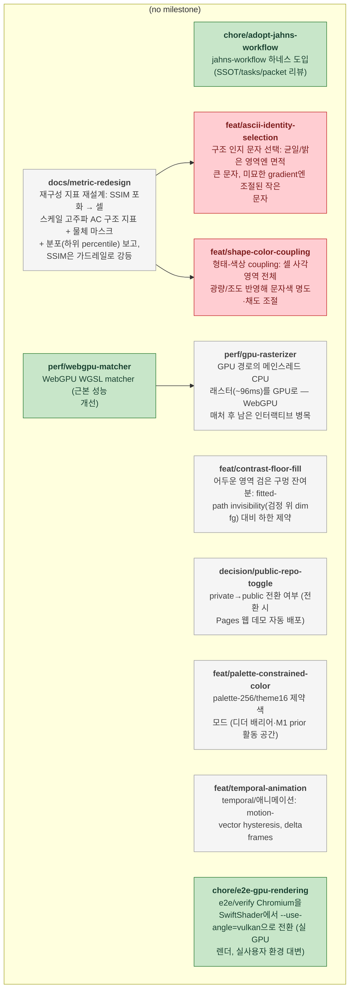

<!-- GENERATED by jahns-workflow (jw_roadmap.py) — DO NOT EDIT.
     Source of truth: tasks.yaml. Regenerated automatically on tasks.yaml edits. -->
# Roadmap — glyphit3d

**Progress:** 3/11 done · 0 active · 2 blocked · generated 2026-07-07 07:45 UTC @ `78e4789`

## Tasks

| ID | Title | Status | Round | Deps | Anchor |
|---|---|---|---|---|---|
| `feat/ascii-identity-selection` | 구조 인지 문자 선택: 균일/밝은 영역엔 면적 큰 문자, 미묘한 gradient엔 조절된 작은 문자 | ⛔ blocked | — | docs/metric-redesign | DESIGN §6 |
| `feat/shape-color-coupling` | 형태-색상 coupling: 셀 사각영역 전체 광량/조도 반영해 문자색 명도·채도 조절 | ⛔ blocked | — | docs/metric-redesign | DESIGN §6 |
| `decision/public-repo-toggle` | private→public 전환 여부 (전환 시 Pages 웹 데모 자동 배포) | ⬜ pending | — | — | — |
| `docs/metric-redesign` | 재구성 지표 재설계: SSIM 포화 → 셀 스케일 고주파 AC 구조 지표 + 물체 마스크 + 분포(하위 percentile) 보고, SSIM은 가드레일로 강등 | ⬜ pending | — | — | DESIGN §10 |
| `feat/contrast-floor-fill` | 어두운 영역 검은 구멍 잔여분: fitted-path invisibility(검정 위 dim fg) 대비 하한 제약 | ⬜ pending | — | — | DESIGN §3 |
| `feat/palette-constrained-color` | palette-256/theme16 제약 색 모드 (디더 배리어·M1 prior 활동 공간) | ⬜ pending | — | — | DESIGN §6 |
| `feat/temporal-animation` | temporal/애니메이션: motion-vector hysteresis, delta frames | ⬜ pending | — | — | DESIGN §4 |
| `perf/gpu-rasterizer` | GPU 경로의 메인스레드 CPU 래스터(~96ms)를 GPU로 — WebGPU 매처 후 남은 인터랙티브 병목 | ⬜ pending | — | perf/webgpu-matcher | DESIGN §7 |
| `chore/adopt-jahns-workflow` | jahns-workflow 하네스 도입 (SSOT/tasks/packet 리뷰) | ✅ done | 2026-07-07-adopt-harness | — | — |
| `chore/e2e-gpu-rendering` | e2e/verify Chromium을 SwiftShader에서 --use-angle=vulkan으로 전환 (실 GPU 렌더, 실사용자 환경 대변) | ✅ done | 2026-07-07-gpu-reality | — | DESIGN §10 |
| `perf/webgpu-matcher` | WebGPU WGSL matcher (근본 성능 개선) | ✅ done | 2026-07-07-gpu-reality | — | DESIGN §7 |
