<!-- GENERATED by jahns-workflow (jw_roadmap.py) — DO NOT EDIT.
     Source of truth: tasks.yaml. Regenerated automatically on tasks.yaml edits. -->
# Roadmap — glyphit3d

**Progress:** 3/18 done · 0 active · 2 blocked · generated 2026-07-07 08:38 UTC @ `c2d6afb`

```mermaid
flowchart TD
    subgraph backlog["(no milestone)"]
        chore_adopt_jahns_workflow["<b>chore/adopt-jahns-workflow</b><br/>jahns-workflow 하네스 도입<br/>(SSOT/tasks/packet 리뷰)"]
        docs_metric_redesign["<b>docs/metric-redesign</b><br/>재구성 지표 재설계: SSIM 포화 → 셀<br/>스케일 고주파 AC 구조 지표 + 물체 마스크<br/>+ 분포(하위 percentile) 보고,<br/>SSIM은 가드레일로 강등"]
        feat_ascii_identity_selection["<b>feat/ascii-identity-selection</b><br/>구조 인지 문자 선택: 균일/밝은 영역엔 면적<br/>큰 문자, 미묘한 gradient엔 조절된 작은<br/>문자"]
        feat_contrast_floor_fill["<b>feat/contrast-floor-fill</b><br/>어두운 영역 검은 구멍 잔여분: fitted-<br/>path invisibility(검정 위 dim<br/>fg) 대비 하한 제약"]
        feat_shape_color_coupling["<b>feat/shape-color-coupling</b><br/>형태-색상 coupling: 셀 사각영역 전체<br/>광량/조도 반영해 문자색 명도·채도 조절"]
        decision_public_repo_toggle["<b>decision/public-repo-toggle</b><br/>private→public 전환 여부 (전환 시<br/>Pages 웹 데모 자동 배포)"]
        perf_webgpu_matcher["<b>perf/webgpu-matcher</b><br/>WebGPU WGSL matcher (근본 성능<br/>개선)"]
        feat_palette_constrained_color["<b>feat/palette-constrained-color</b><br/>palette-256/theme16 제약 색<br/>모드 (디더 배리어·M1 prior 활동 공간)"]
        feat_temporal_animation["<b>feat/temporal-animation</b><br/>temporal/애니메이션: motion-<br/>vector hysteresis, delta<br/>frames"]
        chore_e2e_gpu_rendering["<b>chore/e2e-gpu-rendering</b><br/>e2e/verify Chromium을<br/>SwiftShader에서 --use-<br/>angle=vulkan으로 전환 (실 GPU<br/>렌더, 실사용자 환경 대변)"]
        perf_gpu_rasterizer["<b>perf/gpu-rasterizer</b><br/>GPU 경로의 메인스레드 CPU<br/>래스터(~96ms)를 GPU로 — WebGPU<br/>매처 후 남은 인터랙티브 병목"]
        fix_rematch_single_flight["<b>fix/rematch-single-flight</b><br/>rematch(): 단일<br/>비행(seq/generation) 가드로 최신<br/>run만<br/>grid/raster/SSIM/perf를<br/>commit — 느린 이전 run이<br/>화면·export(json/ans/png)를<br/>덮어쓰지 못하게. controls/ladder의<br/>bare rematch()도 동일 큐를 타야 함"]
        fix_gpu_matcher_p_guard["<b>fix/gpu-matcher-p-guard</b><br/>GpuMatcher:<br/>ensureCellBuffers 캐시 키에 P<br/>포함(numCells만 아님)하고<br/>P&gt;256 거부/상한(WGSL sT<br/>array&lt;f32,768&gt;=3·256<br/>고정으로 첫 run부터 OOB); same-<br/>numCells/different-P 회귀<br/>테스트 추가"]
        decision_profile_stats_objective_contract["<b>decision/profile-stats-objective-contract</b><br/>프로파일 scalar stats(sumA/sum<br/>AA/gradAA/ink) objective<br/>계약 확정: hash 대상<br/>truth(Contract B, hash 범위<br/>확대)인가 coverage에서 decode-<br/>time 재계산(Contract A,<br/>DESIGN §5.4/§5.2)인가 — 현재 B<br/>데이터모델+A hash 범위 혼종이 무결성 공백"]
        docs_wgsl_mirror_kahan_comment["<b>docs/wgsl-mirror-kahan-comment</b><br/>wgsl-mirror.ts stale Kahan<br/>주석 정정: 커널은 8-way-blocked<br/>raw cross 후<br/>saTc=saT−Sa1·mean<br/>(matcher-wgsl.ts 헤더와 동일<br/>표현으로); 수치 무영향 doc drift"]
        fix_e2e_liveness_frame_budget["<b>fix/e2e-liveness-frame-budget</b><br/>e2e check-7 정정: GPU 경로<br/>raster는 메인스레드 동기(~96ms,<br/>주석의 off-thread는 오기),<br/>vacuous한 maxGap&lt;dur를 실제<br/>프레임예산 임계(longtask/maxGap&l<br/>t;~50ms)로 교체"]
        docs_gpu_realtime_wording["<b>docs/gpu-realtime-wording</b><br/>README 헤드라인 'GPU-real-<br/>time' 문구 축소(O3): 'WebGPU<br/>Q3 matcher shipped; full<br/>GPU raster/temporal<br/>coherence remain follow-<br/>ups' — 메인스레드 raster ~96ms<br/>잔존 반영"]
        chore_parity_adversarial_fixtures["<b>chore/parity-adversarial-fixtures</b><br/>parity harness 적대적 fixture<br/>보강(O1): synthetic high-<br/>DC/low-AC 셀, gateTau 경계,<br/>exact/near-tie lower-gi 보존<br/>property, P/G sweep —<br/>'byte-exact'를 유한 14-config<br/>sweep 너머로 확장"]
    end
    docs_metric_redesign --> feat_ascii_identity_selection
    docs_metric_redesign --> feat_shape_color_coupling
    perf_webgpu_matcher --> perf_gpu_rasterizer
    classDef pending fill:#f5f5f5,stroke:#9e9e9e,color:#424242
    classDef active fill:#bbdefb,stroke:#1565c0,color:#0d2b56,stroke-width:2px
    classDef blocked fill:#ffcdd2,stroke:#c62828,color:#7f1d1d
    classDef done fill:#c8e6c9,stroke:#2e7d32,color:#1b4332
    classDef dropped fill:#eeeeee,stroke:#bdbdbd,color:#9e9e9e,stroke-dasharray: 4 4
    class chore_adopt_jahns_workflow,perf_webgpu_matcher,chore_e2e_gpu_rendering done
    class docs_metric_redesign,feat_contrast_floor_fill,decision_public_repo_toggle,feat_palette_constrained_color,feat_temporal_animation,perf_gpu_rasterizer,fix_rematch_single_flight,fix_gpu_matcher_p_guard,decision_profile_stats_objective_contract,docs_wgsl_mirror_kahan_comment,fix_e2e_liveness_frame_budget,docs_gpu_realtime_wording,chore_parity_adversarial_fixtures pending
    class feat_ascii_identity_selection,feat_shape_color_coupling blocked
```

## Tasks

| ID | Title | Status | Round | Deps | Anchor |
|---|---|---|---|---|---|
| `feat/ascii-identity-selection` | 구조 인지 문자 선택: 균일/밝은 영역엔 면적 큰 문자, 미묘한 gradient엔 조절된 작은 문자 | ⛔ blocked | — | docs/metric-redesign | DESIGN §6 |
| `feat/shape-color-coupling` | 형태-색상 coupling: 셀 사각영역 전체 광량/조도 반영해 문자색 명도·채도 조절 | ⛔ blocked | — | docs/metric-redesign | DESIGN §6 |
| `chore/parity-adversarial-fixtures` | parity harness 적대적 fixture 보강(O1): synthetic high-DC/low-AC 셀, gateTau 경계, exact/near-tie lower-gi 보존 property, P/G sweep — 'byte-exact'를 유한 14-config sweep 너머로 확장 | ⬜ pending | — | — | — |
| `decision/profile-stats-objective-contract` | 프로파일 scalar stats(sumA/sumAA/gradAA/ink) objective 계약 확정: hash 대상 truth(Contract B, hash 범위 확대)인가 coverage에서 decode-time 재계산(Contract A, DESIGN §5.4/§5.2)인가 — 현재 B 데이터모델+A hash 범위 혼종이 무결성 공백 | ⬜ pending | — | — | §5.4 |
| `decision/public-repo-toggle` | private→public 전환 여부 (전환 시 Pages 웹 데모 자동 배포) | ⬜ pending | — | — | — |
| `docs/gpu-realtime-wording` | README 헤드라인 'GPU-real-time' 문구 축소(O3): 'WebGPU Q3 matcher shipped; full GPU raster/temporal coherence remain follow-ups' — 메인스레드 raster ~96ms 잔존 반영 | ⬜ pending | — | — | — |
| `docs/metric-redesign` | 재구성 지표 재설계: SSIM 포화 → 셀 스케일 고주파 AC 구조 지표 + 물체 마스크 + 분포(하위 percentile) 보고, SSIM은 가드레일로 강등 | ⬜ pending | — | — | DESIGN §10 |
| `docs/wgsl-mirror-kahan-comment` | wgsl-mirror.ts stale Kahan 주석 정정: 커널은 8-way-blocked raw cross 후 saTc=saT−Sa1·mean (matcher-wgsl.ts 헤더와 동일 표현으로); 수치 무영향 doc drift | ⬜ pending | — | — | — |
| `feat/contrast-floor-fill` | 어두운 영역 검은 구멍 잔여분: fitted-path invisibility(검정 위 dim fg) 대비 하한 제약 | ⬜ pending | — | — | DESIGN §3 |
| `feat/palette-constrained-color` | palette-256/theme16 제약 색 모드 (디더 배리어·M1 prior 활동 공간) | ⬜ pending | — | — | DESIGN §6 |
| `feat/temporal-animation` | temporal/애니메이션: motion-vector hysteresis, delta frames | ⬜ pending | — | — | DESIGN §4 |
| `fix/e2e-liveness-frame-budget` | e2e check-7 정정: GPU 경로 raster는 메인스레드 동기(~96ms, 주석의 off-thread는 오기), vacuous한 maxGap<dur를 실제 프레임예산 임계(longtask/maxGap<~50ms)로 교체 | ⬜ pending | — | — | — |
| `fix/gpu-matcher-p-guard` | GpuMatcher: ensureCellBuffers 캐시 키에 P 포함(numCells만 아님)하고 P>256 거부/상한(WGSL sT array<f32,768>=3·256 고정으로 첫 run부터 OOB); same-numCells/different-P 회귀 테스트 추가 | ⬜ pending | — | — | §5.2 |
| `fix/rematch-single-flight` | rematch(): 단일 비행(seq/generation) 가드로 최신 run만 grid/raster/SSIM/perf를 commit — 느린 이전 run이 화면·export(json/ans/png)를 덮어쓰지 못하게. controls/ladder의 bare rematch()도 동일 큐를 타야 함 | ⬜ pending | — | — | — |
| `perf/gpu-rasterizer` | GPU 경로의 메인스레드 CPU 래스터(~96ms)를 GPU로 — WebGPU 매처 후 남은 인터랙티브 병목 | ⬜ pending | — | perf/webgpu-matcher | DESIGN §7 |
| `chore/adopt-jahns-workflow` | jahns-workflow 하네스 도입 (SSOT/tasks/packet 리뷰) | ✅ done | 2026-07-07-adopt-harness | — | — |
| `chore/e2e-gpu-rendering` | e2e/verify Chromium을 SwiftShader에서 --use-angle=vulkan으로 전환 (실 GPU 렌더, 실사용자 환경 대변) | ✅ done | 2026-07-07-gpu-reality | — | DESIGN §10 |
| `perf/webgpu-matcher` | WebGPU WGSL matcher (근본 성능 개선) | ✅ done | 2026-07-07-gpu-reality | — | DESIGN §7 |
